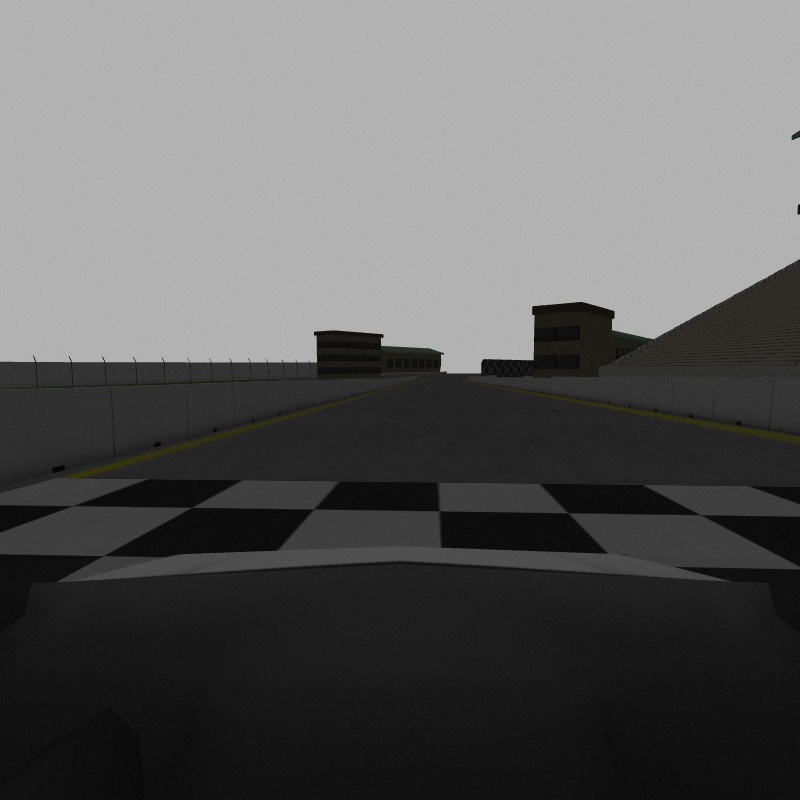

# PathFromImage
A ROS package, which gets real world lane coordinates with only image, camera calibration info, robot model and tf.

### Problem

In most cases for lane following camera image is warped to a top-view perspective. Then goes a pipeline for detecting lane lines, drawing lane area, curvature calculation etc.

For transformation `cv2.getPerspectiveTransform(src, dst)` is used, where `src` are coordinates of the vertices of the trapezoid and `dst` are coordinates of the corresponding points in the top-view image.
<p align="center">
  
</p>

<b>These coordinates should be manually selected every time.

But what if camera tilt has changed, or the mounting point has shifted?</b>

The whole work should be done again.

### Solution

`image_geometry` package has a class `PinholeCameraModel`. It is a model of an idealized monocular camera. Parameters can be set from the `sensor_msgs.msg.CameraInfo` message.

Two very useful functions are `projectPixelTo3dRay(uv)`, which returns the unit vector which passes from the camera center through rectified pixel (u, v). and its inverse `project3dToPixel(point)`.

Why not to use geometry and find intersection of unit vectors and ground plane in the robot frame of reference? This way `src` points can be automatically calculated:
- projectPixelTo3dRay of the left and right bottom image corners
- transform 2 bottom points and camera center from the camera frame to the robot frame
- calculate distance between theese points
- translate these two points to the desired distance ahead, e.g. 10 meters, to get a rectangle
- transform 2 new upper points from the robot frame to the camera frame
- project3dToPixel of upper points
- these four points are `src` points
- `dst` points depend on the desired lane width of the warped image

### Usage

1. Static TF messages should be published, so there is a transformation between robot frame and camera optical frame
> I use URDF robot model with `joint_state_publisher` and `robot_state_publisher`. 
> In the model I added `camera_link_optical` and joint to it from camera, because images use a slightly different axes [convention](http://www.ros.org/reps/rep-0103.html#suffix-frames).
 ```
   # check in RVIZ axes directions
   <joint name="camera_optical_joint" type="fixed">   
    <origin xyz="0 0 0" rpy="-1.5707 0 -1.5707"/>
    <parent link="front_camera_sensor"/>
    <child link="camera_link_optical"/>
  </joint>

  <link name="camera_link_optical">
  </link>
 ```
2. `sensor_msgs.msg.CameraInfo` message should be published.
3. There are 7 parameters that can be declared in the launch file
```
path_from_image = Node(
    package='path_from_image',
    executable='image_warper',
    output='screen',
    parameters=[
        {'_camera_frame': 'camera_link_optical', # name of the optical camera frame
        '_base_frame': 'chassis', # name of the robot base frame
        'distance_ahead': 10.0, # desired distance to look ahead
        'lane_width': 10.0, # desired lane width
        'image_raw': '/vehicle/front_camera/image_raw', # camera image topic name
        'wrap_img': '/wrap_img', # wraped image topic name
        'camera_info': '/vehicle/front_camera/camera_info'} # cameraInfo topic name
    ]
)
```
4. Resulted picture is in the `/wrap_img` topic. Black color indicates zone that is not seen by camera.
<p align="center">
  
  
</p>
